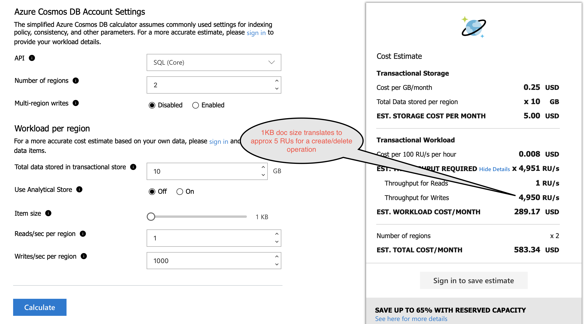
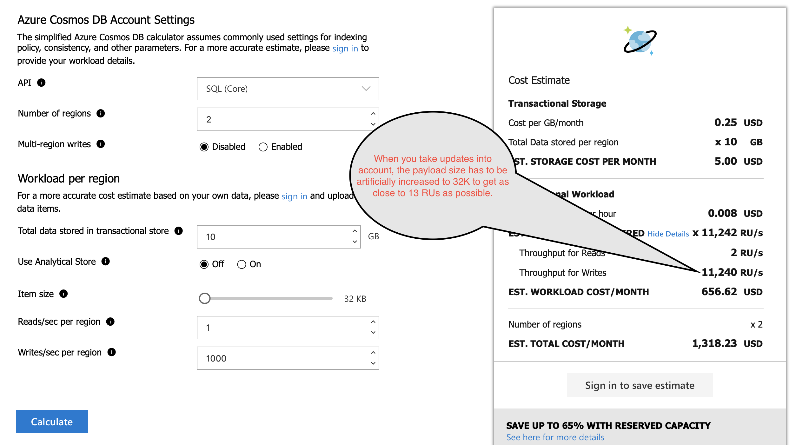

# Analysis Objective
Provide commentary on the RU consumption pattern for this test run. Please refer to Cosmos documentation for an explanation of the terms.

## Test Setup
- Cosmos account configured with session consistency and in a single region - West US
- Client running on a local desktop in San Diego, CA
- Max provisioned RUs = 400
- MaxRetryWaitTimeInSeconds = 10, MaxRetryAttempts = 100 and MaxPoolSize = 10
- Test executed for the following payload sizes: 1000, 5000, 10000, 50000, 100000, 200000 and 400000 bytes
- Each replace and upsert test adds an additional prefix called 'replaced' and 'upserted'
- RUs are collected using Histograms and that can only be an int or a long. Hence, I am using the Math.round() function to round off the RUs
- Test run executed with operation = SQL_ALL 
- Documents created with a single partition key index.

## Observations

### CRUD operations
- As expected, RUs for CRUD operations remain the same irrespective of the execution mode - sync or async
- Data mutation RUs remain the same irrespective of the consistency model 
- Below is a summary of the RUs consumed for various document sizes

| Operation | Doc Size 1k | Doc Size 5k | Doc Size 10k | Doc Size 50k | Doc Size 100k | Doc Size 200k | Doc Size 400k |
| --- | --- | --- | --- | --- | --- | --- | --- |
| write | 7 | 8 | 10 | 24 | 49 | 99 | 186 |
| delete | 7 | 8 | 10 | 24 | 49 | 99 | 186 |
| replace | 13 | 14 | 19 | 46 | 97 | 197 | 370 |
| upsert | 13 | 14 | 19 | 46 | 97 | 197 | 370 |

- The size of the payload is directly proportional to the RU consumption. The bigger the document, the more the RUs you will end up being charged. Scalability and cost efficiency in Cosmos DB comes from leveraging smaller document sizes. 
- The above graph shows a very interesting pattern. While create and delete operations consume exactly the same RUs for a given payload, replace and upsert operations result in a 2x RU consumption. This implies that update/replace operations are twice as expensive as an insert or delete. A typical OLTP use case will usually consist of document creation followed by multiple updates to that document during the entire data lifecycle. This RU consumption pattern directly implies in a post creation cost escalation.
Furthermore, the Cosmos capacity calculator  does not help in the correct cost estimation since the writes/sec/region only accounts for document creation. Given that replace/upsert is 2x the cost of a create/delete, we can make the case that replace or upsert/sec/region should be called out separately.
 

## Estimates vs actuals
Let us start from an initial baseline consisting of a Cosmos account set up with the following topology. This would be reasonable to consider for a production deployment. Please note that I've kept the reads/sec/region artificially low to keep the focus on writes:
- SQL API
- Session consistency
- 2 Regions
- Multi-region writes disabled
- reads/sec/region = 1
- writes/sec/region = 1000

### Cost estimate for create/delete operations

### Cost estimate for update operations

**For update heavy OLTP use cases, the cost difference comes to be 734.89 USD/month. That's a difference of 125.97% over the estimated cost** 

### Read operations
The Cosmos SQL API provides two ways to perform read operations.
- Point reads. Supposed to be more efficient both in terms of latency and RU consumption. A document of size <= 1KB will consume 1 RU. 
- Partition key based SQL queries. Undergoes multiple phases during execution so typically more expensive. A document of size <= 1KB will consume 3 RUs.
- The data gathered from the test shows a very interesting pattern in terms of RU consumption

| Consistency | Operation | Doc size 1k | Doc size 5k | Doc size 10k | Doc size 50k | Doc size 100k | Doc size 200k | Doc size 400k |
| --- | --- | --- | --- | --- | --- | --- | --- | --- |
| Eventual | point read | 1 | 1 | 2 | 5 | 10 | 20 | 41 |
| Eventual | partition key SELECT | 3 | 3 | 3 | 4 | 5 | 6 | 10 |
| Session | point read | 1 | 1 | 2 | 5 | 10 | 20 | 41 |
| Session | partition key SELECT | 3 | 3 | 3 | 4 | 7 | 10 | 17 |
| Bounded Staleness | point read | 2 | 3 | 3 | 10 | 20 | 41 | 82 |
| Bounded Staleness | partition key SELECT | 6 | 6 | 6 | 7 | 9 | 12 | 19 |
| Strong | point read | 2 | 3 | 3 | 10 | 20 | 41 | 82 |
| Strong | partition key SELECT | 6 | 6 | 6 | 7 | 9 | 12 | 19 |

- Eventual and session point reads cost the exact same RUs.
- Eventual and session partition key reads cost the same RUs up to 50K doc size. After that session consistency starts getting more expensive.
- Bounded staleness point reads are at least 2x more expensive compared to session point reads.
- Bounded staleness partition key reads start at 2x more expensive compared to session partition key reads but start tapering off at doc sizes of 50K and beyond.
- Bounded staleness point reads are exactly the same as strong consistency point reads.
- Bounded staleness partition key reads are exactly the same as strong consistency partition key reads. 
 

  
        

     

